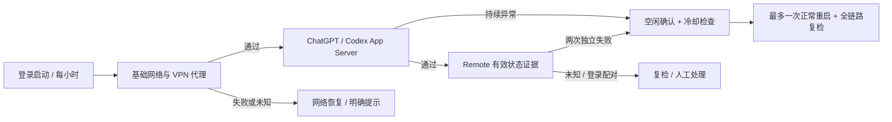

# Auto Connect GPT · autoConnetGPT

[](https://github.com/EricZeng9612/autoConnetGPT/actions/workflows/tests.yml)
[](LICENSE)

**减少 Codex 断连后的反复排查，让手机远程连接 Mac 更省心。**

Auto Connect GPT 是一个面向中国大陆 macOS 用户的轻量级后台连接守护工具。如果你已经具备可用的网络代理，却仍经常遇到 Codex 连接不稳定、手机远程连接找不到电脑，或需要反复检查 VPN、切换节点、重新打开 ChatGPT，本程序可以帮助你按顺序定位问题，并在条件明确、安全可控时尝试恢复，减少回到电脑前手动处理的次数。

它会在登录后启动，立即检查一次，之后默认每小时巡检：**先确认网络和 VPN 代理，再检查 ChatGPT/Codex，最后判断 Remote 状态**。对无法确认的问题明确提示，不会把“进程还在”误报为“远程连接正常”。

> 非 OpenAI 官方产品。项目名 `autoConnetGPT` 按原始命名保留。本工具不提供 VPN、账号或服务访问资格，也不保证解决服务端故障、地区限制、账号权限或所有断连问题；使用时请遵守适用法律及服务条款。

## 能帮你解决什么

| 你遇到的情况 | 程序的处理方式 |
|---|---|
| 电脑空闲后睡眠，手机连接不到主机 | 守护期间维持防空闲睡眠断言；允许显示器正常熄屏 |
| 分不清是 Wi-Fi、VPN 还是 GPT 出问题 | 按“基础网络 → Clash → 代理链路 → 应用 → Remote”分层检测 |
| Clash 内核退出或本地代理端口失效 | 尝试启动，必要时正常退出并重启一次；受冷却限制 |
| 代理链路持续故障，需要手动换节点 | 配置后，在可用的新加坡候选中按实测延迟从低到高尝试；失败回滚 |
| ChatGPT 未运行 | 在网络正常及恢复额度允许时启动 |
| App Server 或 Remote 异常 | 复检确认后，仅在能证明任务空闲时尝试正常重启；忙碌/未知则延后 |
| 问题无法自动修复 | 保留状态、动作记录及人工处理 SOP；状态变化时通知 |

## 必须知道的检测边界

**v2 已实现 Remote 三态判断和安全恢复状态机，但没有附带官方 Remote/任务状态采集器。** 默认配置下，Remote 状态为 `REMOTE_UNKNOWN`，不会因为缺少证据而重启应用。要启用基于 Remote 故障的自动恢复，必须接入可验证的在线状态和任务空闲证据，格式见 [状态采集器接口](docs/EVIDENCE.md)。不要用固定 JSON、历史日志、进程存在或端口连通来伪造在线/空闲状态。

**自动切换节点默认未启用。** 必须配置你允许程序修改的一个 Mihomo `Selector` 代理组，以及确认位于新加坡的候选节点名单。本程序不改变订阅、不新增节点、不自动修改路由规则。该代理组必须实际影响 ChatGPT/Remote 的出站路径。

“最低延迟”指：**本轮配置候选中，通过双目标探测、对 ChatGPT 探测地址多次测得的中位延迟最低**，不是对所有供应商或所有时刻的保证。最快候选切换后验证失败，会回滚并尝试下一个；最多尝试三个。当前节点不作为“新节点”。

## 恢复流程



完整流程图已随仓库发布：[分阶段 SOP 流程图](docs/FLOWCHART.md)。将网络、节点选择、应用恢复拆分绘制，主线自上而下，避免回路线交叉。

## 安装与升级

环境要求：macOS、Python **3.9+**、当前用户已登录桌面；默认适配 `/Applications/ChatGPT.app` 和 `/Applications/Clash Verge.app`，HTTP 代理端口 `7897`。这不是独立 Codex.app 或其他 VPN 客户端的通用适配器。

```bash
git clone https://github.com/EricZeng9612/autoConnetGPT.git
cd autoConnetGPT
python3 --version
zsh install.zsh
```

如果找不到 Python，先自行安装 Python 3.9+。可用 `AUTOCONNETGPT_PYTHON=/绝对路径/python3 zsh install.zsh` 指定解释器。安装器固定解释器路径，避免登录后 PATH 不同而启动失败。无需管理员密码；macOS 可能要求允许自动化控制应用或显示通知。

升级已有安装：在仓库目录执行 `git pull --ff-only`，再运行 `zsh install.zsh`。**仅更新 GitHub 或拉取代码不会替换正在运行的版本。** 安装器会先停止旧后台服务，备份原安装及 LaunchAgent，保留已有 `config.json`、恢复历史和日志，再启动新版本；失败时会明确停止，不删除备份。

从 v1 升级：改用 `config.json` 配置，不再读取旧的 `AUTOCONNETGPT_CHECK_INTERVAL`、`AUTOCONNETGPT_PROXY_URL`、`AUTOCONNETGPT_PROXY_PORT`、`AUTOCONNETGPT_CHECK_URL` 运行参数。请把自定义端口、周期等迁移至 JSON。v1 日志保留在原来的 `~/Library/Logs/autoConnetGPT/`。

## 配置新加坡节点优选

安装后编辑 `~/Library/Application Support/autoConnetGPT/config.json`，完整字段见 [配置示例](config.example.json)。下面只展示需要按实际情况修改的字段，其他字段保留：

```json
{
  "selector_group": "填写实际生效的手动选择组名",
  "singapore_nodes": ["填写新加坡节点完整名称一", "填写新加坡节点完整名称二"],
  "allow_singapore_name_match": false,
  "controller_socket": "/tmp/verge/verge-mihomo.sock",
  "controller_url": "http://127.0.0.1:9090",
  "controller_secret_file": ""
}
```

- 名称必须与 Clash 中完全一致。只支持该组的**直接叶子节点**，不递归修改嵌套策略组。
- 推荐明确的 `singapore_nodes` 白名单；节点地理位置由你/供应商确认。可选名称匹配识别 `新加坡`、`Singapore`、`SG` 等，但名称不等于真实出口位置，因此默认关闭。
- 默认最多 20 个候选，每节点 3 轮“双目标”测试，以 ChatGPT 目标延迟中位数排序。超过候选上限会要求缩小名单，不会悄悄取部分节点后宣称最低。
- 优先使用已存在的本地 Unix socket；没有 socket 时使用配置的 loopback HTTP 控制接口。控制接口不可访问/未授权，不会被当成内核故障而重启 Clash。
- 若控制接口需要密钥，将其放入当前用户拥有的独立文件，权限 `600`，在 `controller_secret_file` 填绝对路径。不要写入仓库或公开 issue。
- 探测收到 403、429 或 5xx 会报告“无法确认”，**不会一律判为健康，也不会因此切节点**。需要先人工辨别验证页面、服务端故障或权限问题。
- `basic_urls` 应是当前网络可直接访问的 HTTPS 地址；TUN/透明代理环境下，“不使用 HTTP 代理”不代表完全绕过 VPN，可能需要调整探测目标。

更改配置后需重启后台服务以重新加载：

```bash
launchctl kickstart -k "gui/$(id -u)/com.eric.autoConnetGPT"
```

此命令只重启本守护程序，不代表重启 ChatGPT。但它随后会立即按新配置检查。节点事务在每次修改前持久化；中途退出时会在下次检查优先完成回滚。

## 查看与诊断

```bash
# 最近状态（不会执行恢复）
"$HOME/Library/Application Support/autoConnetGPT/autoConnetGPT.zsh" --status

# 只读诊断：会发起网络探测，但不切节点、不重启应用、不改恢复历史
"$HOME/Library/Application Support/autoConnetGPT/autoConnetGPT.zsh" --diagnose

# 立即检查，允许按安全规则恢复
"$HOME/Library/Application Support/autoConnetGPT/autoConnetGPT.zsh" --check

# 最近状态及当前电源设置/睡眠断言
"$HOME/Library/Application Support/autoConnetGPT/autoConnetGPT.zsh" --diagnostics

# 日志（每份最多 5 MB，保留两份轮转备份）
tail -f "$HOME/Library/Application Support/autoConnetGPT/autoConnetGPT.log"
```

程序、配置、`status.json`、`recovery.json` 和 v2 日志位于 `~/Library/Application Support/autoConnetGPT/`。LaunchAgent 为 `~/Library/LaunchAgents/com.eric.autoConnetGPT.plist`。恢复状态包含本地节点事务，**不要上传整个运行目录**。

| 主要状态 | 意义 / 下一步 |
|---|---|
| `HEALTHY` | 当前检查的代理、本地应用、有效 Remote 证据均通过；不是永久在线保证 |
| `NETWORK_UNAVAILABLE` | 优先检查基础网络、路由器、Wi-Fi 认证 |
| `VPN_PATH_UNKNOWN` | HTTP 返回结果不够确定；人工辨别，不自动切换 |
| `VPN_CONFIG_REQUIRED` / `VPN_NO_SG_NODE` | 需配置代理组/候选，或本轮没有通过测试的新加坡节点 |
| `VPN_CONTROLLER_UNAVAILABLE` | 检查本地控制接口和密钥权限 |
| `VPN_ROLLBACK_REQUIRED` / `VPN_SELECTION_CHANGED` | 回滚受阻或外部修改节点，停止自动操作 |
| `VPN_NEEDS_ATTENTION` | 有限恢复后代理仍异常 |
| `REMOTE_UNKNOWN` | 没有足够的新鲜 Remote 证据；不等于离线 |
| `REMOTE_MANUAL` | 需要登录、配对或手动启用 Remote |
| `RESTART_DEFERRED` / `TASKS_NEED_ATTENTION` | 无法证明任务空闲，延后或转人工 |
| `REMOTE_NEEDS_ATTENTION` | 本地应用/Remote 恢复后仍异常 |
| `COOLDOWN` / `RESTART_LIMIT` | 限制频繁恢复，等待冷却或人工排查 |
| `HOST_SLEEP_RISK` | 未观察到防睡眠断言；不直接改变系统电源设置 |
| `CHECK_ERROR` / `CHECK_TIMEOUT` | 配置、状态、权限或预算异常，安全停止 |

详细处理步骤见 [SOP](SOP.md)。

## 安全与恢复限制

- 单实例锁防止并发巡检。动作前记录持久化额度：Clash 30 分钟冷却、节点切换批次 6 小时冷却、ChatGPT 启动/重启 6 小时冷却且最多 2 次/24 小时。失败尝试同样计数。
- 每轮应用恢复最多一次；任务忙碌或未知时延后 10 分钟，最多两次，然后转人工。巡检总预算约 15 分钟，各网络请求也有超时。
- 不强制杀进程、不退出账号、不自动填写密码或验证码、不重置配对、不修改系统睡眠设置、不公开 App Server 端口。
- 屏幕熄灭不等于系统睡眠。`caffeinate -is` 用于维持后台主机唤醒，其中 `-s` 仅在接电时有效。合盖、手动睡眠、关机、断电仍可中断服务；建议远程主机接电运行。
- macOS 完全睡眠时脚本本身无法检查或自救，唤醒后才能继续。登录前也不会运行用户 LaunchAgent。
- 本地主机检查不能完整替代“手机 → 网络 → Remote 主机”的端到端验证；手机侧网络故障仍需在手机处理。

## 测试与卸载

```bash
python3 -m unittest discover -s tests -v
zsh -n autoConnetGPT.zsh install.zsh uninstall.zsh
zsh uninstall.zsh
```

卸载会停止服务，把安装目录和 LaunchAgent 移到带随机后缀的 `autoConnetGPT-uninstalled-*` 归档中，配置和日志可恢复，不进行递归删除。

## 参考与许可证

- [Mihomo 控制接口](https://wiki.metacubex.one/en/api/)：节点读取、延迟测试与选择操作。
- [OpenAI Remote connections](https://learn.chatgpt.com/docs/remote-connections)：Remote 使用说明；本项目没有假定存在未验证的本地健康 API。
- [安全说明](SECURITY.md) · [更新记录](CHANGELOG.md) · [MIT License](LICENSE)
