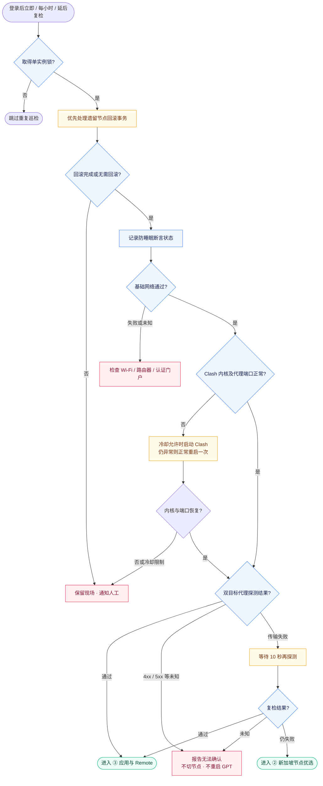
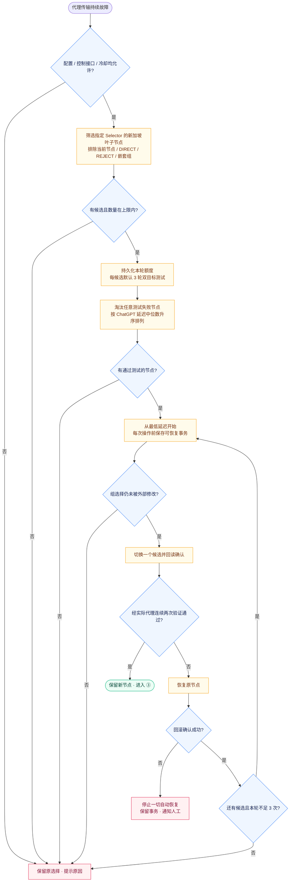
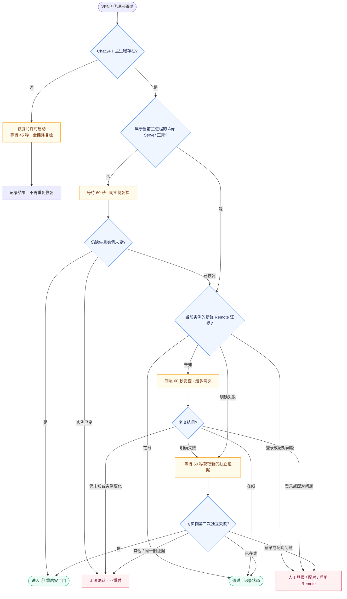
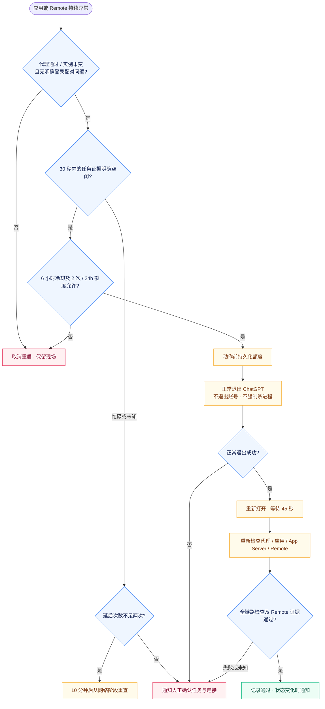

# Auto Connect GPT · 连接守护流程

**阅读顺序：① 网络优先 → ② 必要时优选新加坡节点 → ③ 应用与 Remote → ④ 安全重启。**

蓝色为检查，黄色为受限恢复，绿色为通过，红色为停止/人工处理。拆成四张图，跨阶段只用明确出口衔接，不绘制贯穿全图的长回线。所有结束均记录结果，下一轮重新从网络检查开始。

## ① 网络优先

## ② 新加坡节点优选

这里的“最低延迟”限定于本轮配置范围内、全部测试合格的候选。最快者切换后验证不通过，则尝试次快者。切换批次冷却 6 小时；候选组须实际影响目标流量，程序不擅改路由规则。

## ③ 应用与 Remote

Remote 没有证据 ≠ Remote 离线。默认未接入采集器时，此阶段报告未知；不得用 App Server 存在替代远程可用性。应用主进程变化时旧证据作废。

## ④ 重启安全门与闭环

每轮应用恢复最多一次，失败也占用额度。单轮约 15 分钟时间预算；恢复动作结束后回到正常定时巡检，不用无上限回路重复切换或重启。`--diagnose` 只读模式跳过全部恢复动作和等待复检。
